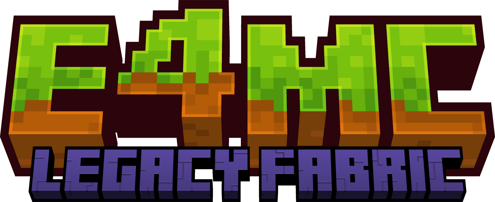

<h1 align="center">
  
</h1>

This module implements e4mc-retro for the [Legacy Fabric](http://legacyfabric.net/) mod loader, allowing players on Legacy Fabric to share their LAN worlds over the internet.

Due to the absence of a Legacy Fabric API for Minecraft 1.13+, we integrated [ForwarD-NerN's ResourceLoader](https://github.com/ForwarD-NerN/ResourceLoader-1.13.2), which is licensed under the [Apache License 2.0](https://github.com/ForwarD-NerN/ResourceLoader-1.13.2/blob/master/LICENSE). This library is used to load the necessary e4mc resources.